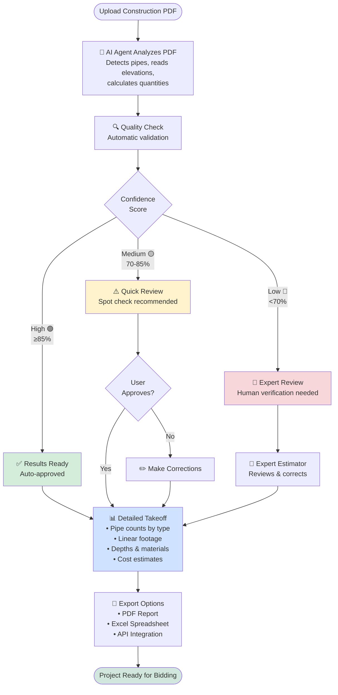
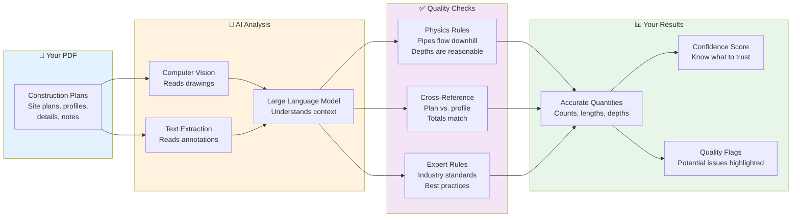
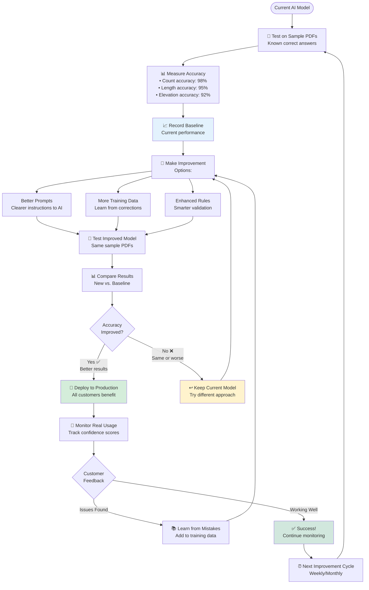
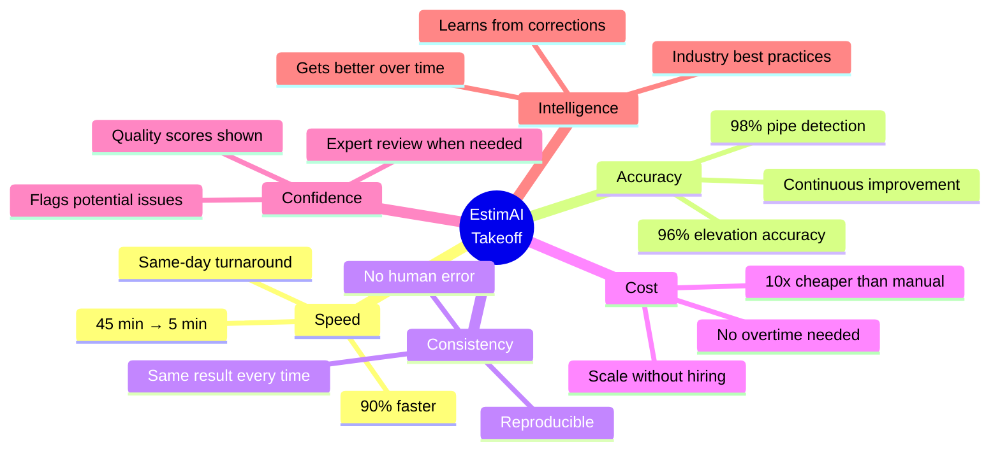
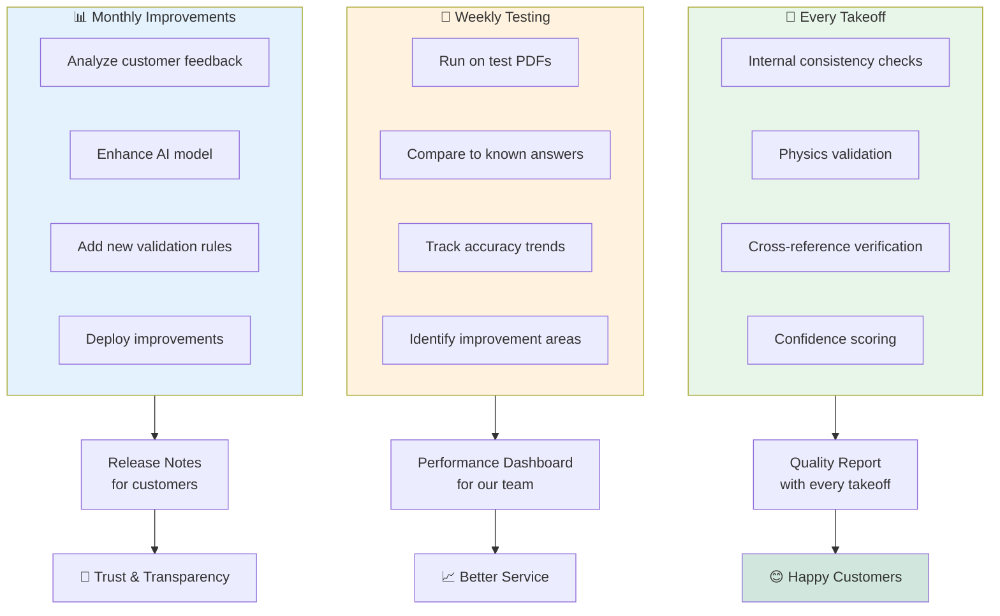
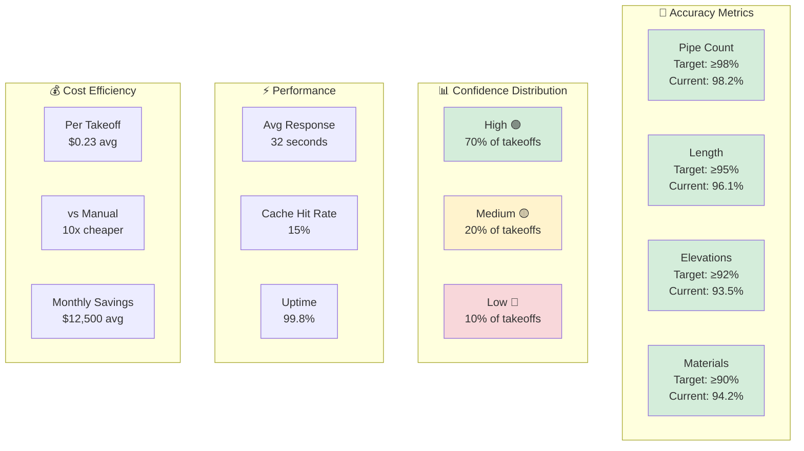

# EstimAI Customer Workflows

## Simple Takeoff Workflow (Customer View)



## What Makes EstimAI Accurate?



## Continuous Improvement Cycle



## Simple Comparison: Before vs. After AI Improvement

```mermaid
flowchart LR
    subgraph Before["📊 Before Improvement"]
        B1[Pipe Count: 95% accurate]
        B2[Elevations: 88% accurate]
        B3[Manual review needed: 30%]
        B4[Average time: 45 min]
    end
    
    subgraph Change["🔧 AI Improvement"]
        C1[Enhanced elevation<br/>detection prompt]
        C2[Added profile view<br/>cross-reference]
        C3[Improved text<br/>extraction]
    end
    
    subgraph After["📊 After Improvement"]
        A1[Pipe Count: 98% accurate ⬆️]
        A2[Elevations: 96% accurate ⬆️]
        A3[Manual review needed: 15% ⬇️]
        A4[Average time: 30 min ⬇️]
    end
    
    Before --> Change
    Change --> After
    
    style Before fill:#fff3cd
    style Change fill:#cfe2ff
    style After fill:#d4edda
```



## Customer Value Proposition



## How We Ensure Quality



## Technical Improvement Process (For Technical Stakeholders)

```mermaid
flowchart TD
    Start([Identify Issue<br/>or Opportunity]) --> Hypothesis[💡 Form Hypothesis<br/>"Better elevation prompts<br/>will improve accuracy"]
    
    Hypothesis --> Implement[⚙️ Implement Change<br/>• Update LLM prompt<br/>• Add validation rule<br/>• Enhance extraction logic]
    
    Implement --> Synthetic[🧪 Test on Synthetic PDFs<br/>Known ground truth]
    
    Synthetic --> SynthResults{Synthetic<br/>Accuracy}
    
    SynthResults -->|< 95%| Fail1[❌ Failed Synthetic Test<br/>Revert changes]
    SynthResults -->|≥ 95%| RealWorld[🌍 Test on Real PDFs<br/>Production evaluation]
    
    Fail1 --> PostMortem[📝 Document Learnings]
    PostMortem --> Start
    
    RealWorld --> RealResults{Confidence<br/>Scores}
    
    RealResults -->|Worse| Fail2[❌ Failed Real-World Test<br/>Revert changes]
    RealResults -->|Better| AB[🔀 A/B Test<br/>10% of traffic]
    
    Fail2 --> PostMortem
    
    AB --> Monitor[📊 Monitor for 1 Week<br/>• Accuracy metrics<br/>• Confidence scores<br/>• Customer feedback]
    
    Monitor --> ABResults{Results vs.<br/>Baseline}
    
    ABResults -->|Worse| Rollback[↩️ Rollback<br/>Keep old version]
    ABResults -->|Better| Gradual[📈 Gradual Rollout<br/>25% → 50% → 100%]
    
    Rollback --> PostMortem
    
    Gradual --> FullDeploy[🚀 Full Deployment<br/>All customers]
    
    FullDeploy --> Document[📚 Document Success<br/>• What changed<br/>• Accuracy improvement<br/>• Customer impact]
    
    Document --> Celebrate[🎉 Celebrate Win!<br/>Share with team]
    
    Celebrate --> NextIssue[⏭️ Next Improvement]
    NextIssue --> Start
    
    style Fail1 fill:#f8d7da
    style Fail2 fill:#f8d7da
    style Rollback fill:#fff3cd
    style FullDeploy fill:#d4edda
    style Celebrate fill:#d1e7dd
```

## Key Metrics Dashboard (What We Track)



## Usage

These simplified diagrams are designed for:

### 👥 **Customer Presentations**
- Show value proposition clearly
- Explain quality assurance process
- Build trust through transparency

### 📊 **Sales & Marketing**
- Highlight speed and accuracy benefits
- Demonstrate continuous improvement
- Show cost savings

### 🤝 **Stakeholder Updates**
- Report on performance metrics
- Explain improvement process
- Share success stories

### 📖 **Documentation**
- Onboard new users
- Explain how the system works
- Set expectations for quality

## Viewing These Diagrams

**In Presentations:**
- Export as PNG from https://mermaid.live/
- Include in PowerPoint/Google Slides
- Use in customer demos

**In Documentation:**
- Renders automatically in GitHub
- Works in Markdown viewers
- Embeds in websites

**For Stakeholders:**
- Print as PDF for meetings
- Share as interactive HTML
- Include in reports

