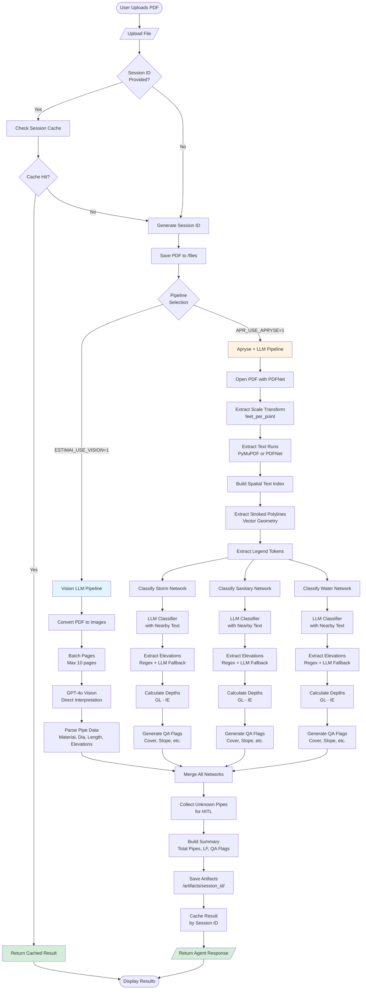
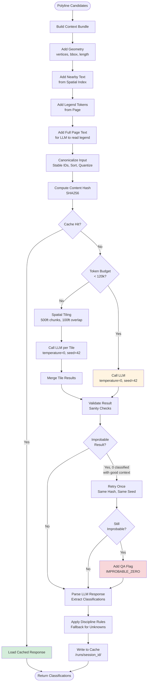
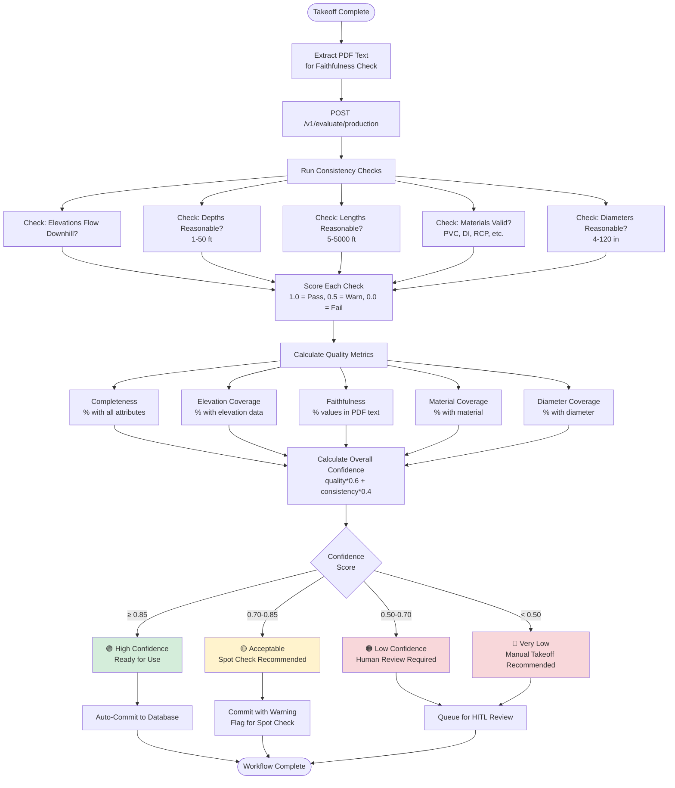
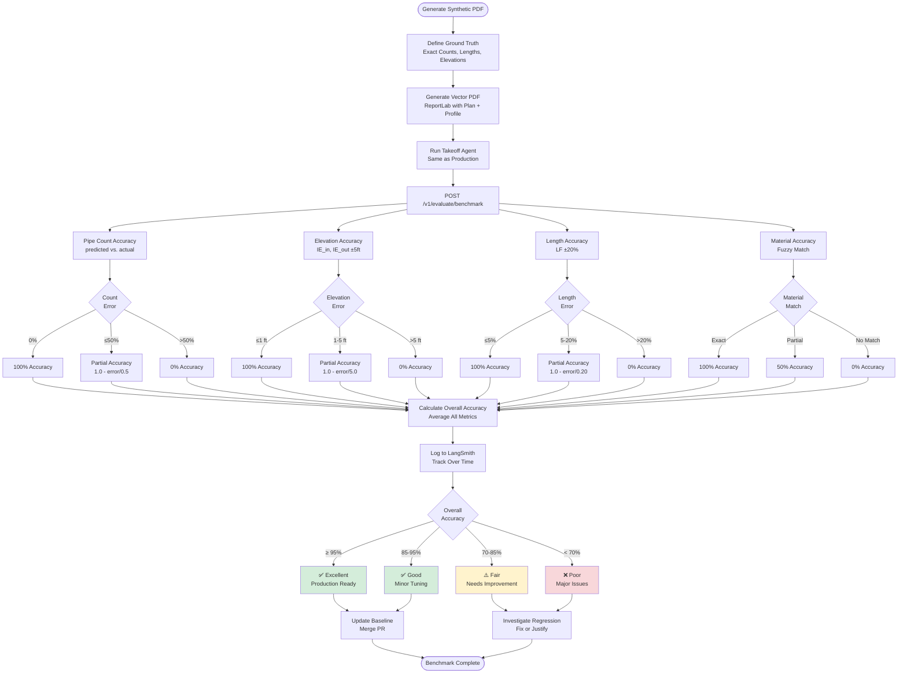
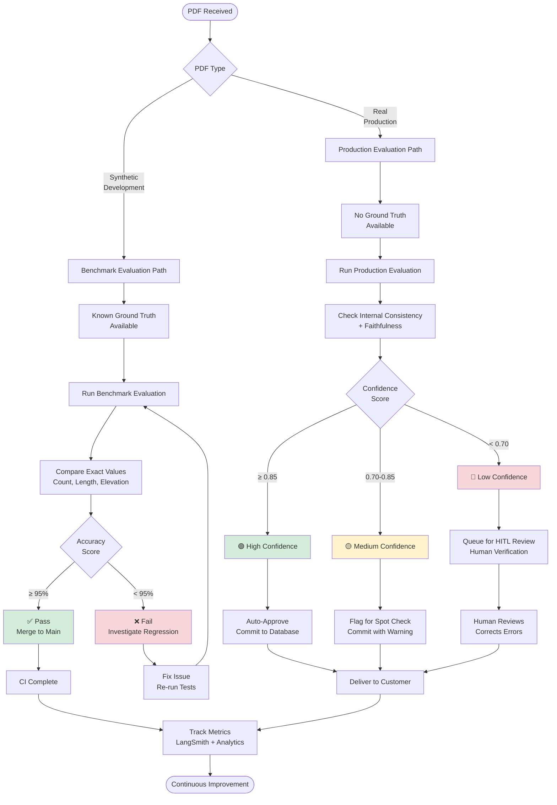
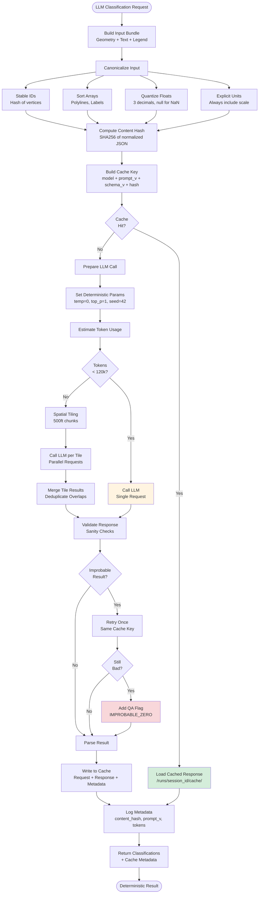

# EstimAI Workflow Diagrams

## Takeoff Workflow

### Complete Takeoff Pipeline

### LLM Classification Detail (Apryse Pipeline)

## Evaluation Workflows

### Production Evaluation (No Ground Truth)

### Benchmark Evaluation (With Ground Truth)

### Combined Evaluation Strategy

## Determinism & Caching Flow

## Usage Examples

### View Diagrams

These diagrams are written in Mermaid syntax and can be viewed in:

1. **GitHub** - Automatically renders in README.md and .md files
2. **VS Code** - Install "Markdown Preview Mermaid Support" extension
3. **Mermaid Live Editor** - https://mermaid.live/
4. **Documentation Sites** - MkDocs, Docusaurus, etc.

### Customize

To modify these diagrams:

1. Copy the Mermaid code block
2. Paste into https://mermaid.live/
3. Edit and preview in real-time
4. Copy updated code back to this file

### Export

From Mermaid Live Editor, you can export as:
- PNG image
- SVG vector graphic
- PDF document
- Markdown with embedded diagram

